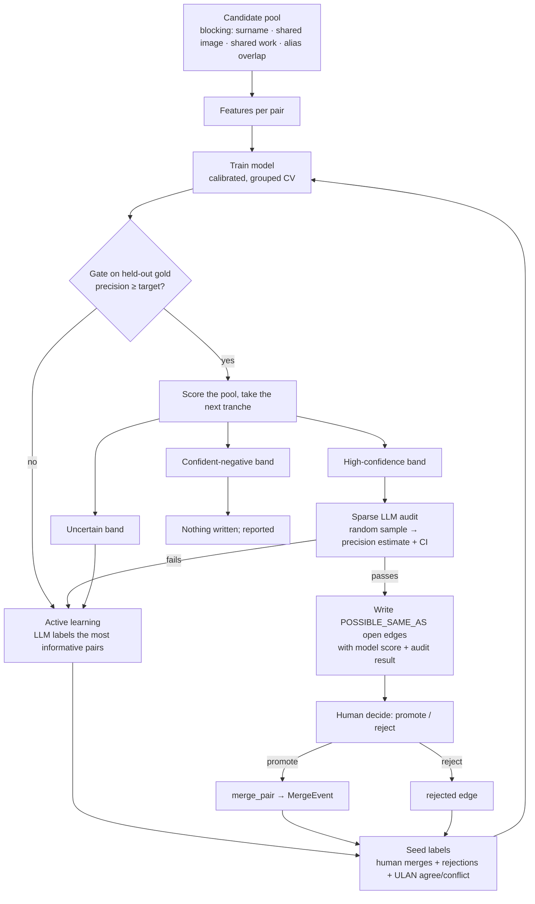

# Artist-merge review agent: iterative semi-supervised learning

**Status:** design only, 2026-09-22. Nothing is built.

## Goal

This is a scheduled agent that keeps reviewing Artist pairs that might be one person. It learns a
merge model from a small, high-confidence seed. It spends LLM calls only where they change the
model or check it. The pairs it trusts go into the existing review queue (`POSSIBLE_SAME_AS`),
not straight into merges.

**The one hard constraint comes from this graph's history:** similarity scoring has caused two
real corruption incidents here. So the model **proposes and ranks**; it never merges on its own.
A merge still goes through `merge_artists.merge_pair`, with its provenance, its merge record and
its refusal of rejected pairs. Auto-merge is a separate, later decision, reached only through the
gate in Phase 5.

---

## What already exists

| Need | Already in the repo / graph |
|---|---|
| Candidate generation | Splink blocking and weights (`fit_splink_artist_identity.py`); the shared-image scan (`find_artist_candidates_by_shared_image.py`); the name rules (`find_artist_merge_candidates.py`) |
| Positive labels | 297 Artist merge records. `decidedBy`/`rule` say how each was decided, so they can be weighted |
| Negative labels | 60 rejected `POSSIBLE_SAME_AS` edges (collaborations, ULAN conflicts, human refusals); `artist_never_merge.csv` |
| Independent ground truth | ULAN ids via the local mirror (`ulan_local.sqlite`, with bio and dates), used to validate Splink on 2026-09-12 |
| Review queue and decisions | `POSSIBLE_SAME_AS` + `identity_candidates.py list / decide` |
| LLM adjudicator evidence | Haiku 4.5 reached 13/14 of Opus on vision adjudication at ~10× less cost; Gemini 2.5 Flash and Qwen were unusable (refusals, confabulation) |
| Write path | `merge_pair` (provenance required, merge record written, rejected pairs refused), `check_merges_not_undone.py`, `check_identity_candidates.py` |

---

## The loop

Every human decision goes back into the seed, so the model is retrained on it next round. LLM
labels go into the seed marked as weaker than human ones. The model's own predictions never
become training labels, with one narrow exception described in step 5 (self-training).

---

## Components

### 1. Candidate pool (blocking)

Scoring every pair of 11.6k artists is 67M pairs, which is too many to score. Instead a pair
enters the pool if any of these blocks fires:

- **Surname:** the same folded surname token. This is Splink's block; its coverage is measured.
- **Shared image:** DINOv2 cross-attribution at cosine ≥ 0.93, the existing scan.
- **Shared work:** both nodes `CREATED` the same ConceptualWork, or both are `ATTRIBUTED_TO` from
  one SourceRecord. This was the strongest signal in A4.
- **Alias overlap:** one node's `alternateNames` holds the other's name.
- **Initialism / abbreviation:** `R.B. Kitaj` / `Ronald Brooks Kitaj`. Splink scores these at
  −9 to −17, so they need their own block.

Pairs are dropped if they already have a merge record, a rejected edge, or an open edge that a
person has already looked at.

**Phase 0 measures** pool size per block and, using the 297 known merges, each block's recall:
how many true merges each block would have surfaced.

### 2. Features

The features are the ones that separated real duplicates from traps in this graph's history. A
feature is not included just because it is available.

- **Name:** the level ladder from `merge_artists.name_level` (exact under normalisation, same
  token bag, token subset, Jaro-Winkler ≥ 0.94, edit ≤ 2), plus honorific/post-nominal stripped
  equality, initialism match and surname rarity.
- **Dates:** birth and death agreement, the size of any gap, and whether either year is
  impossible (Peri: born after his own death).
- **Identifiers:** ULAN agree / conflict / one-sided; Wikidata likewise. A conflict is strong
  evidence, **not** proof: the Van Gogh node's ULAN was his uncle's.
- **Images:** DINOv2 max and median cross-similarity, **with the thinner side's image count as
  a feature in its own right**. The 0.80 floor measured sample size, not identity (median 0.48
  at 0–2 images against 0.78 at 6–15).
- **Structure:** shared works, shared SourceRecords, same-house-only (recreated by one ingest),
  and work-count ratio.
- **Known trap flags:** collaboration strings (`&`, `and`, `with`), collectives and workshops,
  `after` / `school of` / `follower of`, placeholders (`Anonymous…`), family names shared across
  generations (Calder, Piranesi, Pissarro), and wrapper names (`… (British b. 1968-) &`).
- **Splink match weight** as one feature among many. It does **not** order merge risk on its
  own (it inverts at both ends).

### 3. Seed set and gold set

**The seed** is the high-confidence pairs:

| Label | Source | Weight |
|---|---|---|
| positive | merge records with `decidedBy: human` (reviewed pairs, A4, alias-shadowing) | 1.0 |
| positive | merge records by exact rules (`ulanCanonical`, `caseFold`, `nameNormalised`) | 1.0 |
| positive | merge records by fuzzy + image rules (`nameFuzzyImageCorroborated`, `nameTypoDatesAgree`) | 0.7 |
| negative | rejected edges with `decidedBy: human` | 1.0 |
| negative | rejected by rule (collaboration, ULAN conflict with dates also disagreeing) | 0.8 |
| negative | sampled **hard negatives**: same surname block, different ULAN and dates ≥ 10 years apart | 0.8 |

Hard negatives are what make the model useful. Random non-pairs are trivially different, and a
model trained on them learns nothing about the Calder trap.

**The gold set** is set aside and never trained on: about 150 pairs a person labels once,
stratified across name level × house × trap flag. It is the only set whose numbers get quoted.
This follows the rule to check a class × source confound before quoting any number: Roseberys
created most duplicates, so a set drawn at random would mostly measure Roseberys.

### 4. Model

- **Model:** gradient-boosted trees (e.g. LightGBM) or logistic regression on the features
  above, calibrated with isotonic regression so the scores mean probabilities. The candidate
  pool is small, so the model is fast and inspectable. SHAP values per pair make the evidence
  readable, in keeping with the preference for a traceable decomposition.
- **Validation is grouped by artist cluster,** not by pair. Two pairs sharing a node must not
  sit on opposite sides of a split, which is the same leakage lesson as the artist-grouped split
  in the technique classifier (−0.30 macro-F1).
- **Report** precision at the operating threshold on the gold set, with a cluster bootstrap CI,
  broken down by house and name level.

### 5. The semi-supervised part

Each round combines three techniques, each used where it is safe:

1. **Active learning (the main mechanism).** The LLM labels the pairs the model is least sure
   of, with margin sampling around p ≈ 0.5 and diversity enforced across blocks and houses. This
   is what the LLM budget is for. Around 30–60 labels a round moves the boundary more than
   thousands of confident pairs would.
2. **Sparse audit (the check the brief asks for).** A **random** sample from the high-confidence
   band, around 20–30 pairs, is labelled by the LLM. It estimates that band's precision with a
   Wilson interval. It is random, not targeted, so the estimate is unbiased. The band's pairs
   become review candidates only if the interval's lower bound clears the target.
3. **Self-training, restricted.** Pseudo-labels (the model's own confident predictions) are
   allowed only for **negatives** at very low scores, with low weight, to widen coverage of easy
   non-matches. **Confident positives are never pseudo-labelled.** A model that teaches itself its
   own merges drifts towards merging, and here that failure is corruption.

**Why the LLM is a labeller and not the judge:** its errors correlate with the model's when both
see the same name evidence. So the LLM prompt is given evidence the model does not weight:
- the ULAN bio and dates from the local mirror;
- sample titles and media for each side;
- the source houses;
- up to 4 images per side;
- the known trap list, written out.

It must return `same | different | unsure` with a cited reason. `unsure` goes to a human and
never to training.

**Calibrating the LLM before trusting it:** Phase 0 runs the LLM over the gold set and measures
its agreement per stratum, the same idea as the parser-oracle Phase 0. A stratum where it falls
below about 95% (likely collaborations and family names) does not get LLM labels. Those pairs go
to a person.

### 6. Tranches and stopping

**Tranche size** doubles while the audits pass and halves after a failure.

**Each round ends in one of three ways:**
- the audit passes: write open edges;
- the audit fails: more active learning on the failing stratum and no edges written;
- no uncertain pairs remain: the model has converged on this pool.

**Stop the run** when the LLM budget for the run is spent, or after two failed audits in a row.
That usually means a feature is missing, which is a job for a person, not for more labels.

**Clusters:** before writing edges, find the connected groups the high-confidence pairs form.
Any group larger than 2 is checked for internal rejected edges, and for a group chaining through
a collaboration node (e.g. Christo – Christo and Jeanne-Claude – Jeanne-Claude). Such a group is
written as individual open edges with a `clusterRisk` note and is never proposed as a block.

### 7. What the agent writes

- `POSSIBLE_SAME_AS` open edges with `rule: 'mergeModel'`, `ruleVersion` equal to the model
  version, `score` equal to the calibrated probability, and `evidence` holding the top SHAP
  contributions plus the LLM verdict if one was made.
- A run report: pool size, labels spent, gold-set precision and CI, audit results, the tranche,
  cluster warnings, and pairs routed to a human.
- **No merges and no rejections.** A person does those through `identity_candidates.py decide`.
  Every decision feeds the next round's seed.

The model file, feature snapshot and labels are kept on disk and versioned per run. The graph
holds the edges, not the model.

---

## Scheduling

- **Trigger:** weekly, or after any ingest run, since new houses create new duplicates.
- **Where:** a local scheduled task or a cloud routine. It needs read access to Neo4j, write
  access to `POSSIBLE_SAME_AS` only, the local ULAN mirror and the embeddings.
  - A **cloud routine** needs the Neo4j credentials and a copy of the ULAN mirror.
  - **Local** is simpler to start with.
- **Per-run budget:** a hard cap on LLM calls (e.g. 150). If the budget runs out, the run stops
  and says so.
- **Cost:** Haiku 4.5 as the default labeller. Opus is used only for pairs Haiku marks `unsure`
  that carry images. The expected cost per run is small (hundreds of calls); the budget cap
  enforces it.
- **Output:** the run report, plus a notification with counts. The review CSV comes from
  `identity_candidates.py list --label Artist`.

---

## Phases

| Phase | What | Gate |
|---|---|---|
| **0. Measure** | Pool size and recall per block against the 297 known merges; build the gold set (~150, human-labelled once); calibrate Haiku on it per stratum | LLM agreement ≥ 95% on the strata it will label |
| **1. Seed model** | Features, seed from merge records, rejections and hard negatives; grouped CV; calibration | Gold precision at the operating point ≥ 0.95, CI lower bound ≥ 0.90 |
| **2. One manual round** | Run the loop once by hand: active learning, audit, write about 30 open edges, a person decides them | Human agreement with the model's top band ≥ the audit's estimate |
| **3. Schedule** | Wrap it as a scheduled agent with the budget cap and run report | Two consecutive runs with passing audits |
| **4. Work-level** (optional) | The same loop for ConceptualWork pairs (spelling variants, title collisions), using the existing vision adjudicator | Separate gold set; works have their own risk axes (series titles, variation series, states vs plates) |
| **5. Auto-merge tier** (separate decision) | Pairs above a very high threshold **and** in a stratum with a long passing audit record are merged by `merge_pair` with `decidedBy: model` | Your explicit sign-off. Every model merge stays reversible through its merge record |

---

## Risks and how the design meets them

| Risk | Mitigation |
|---|---|
| Confirmation drift (the model teaches itself to merge) | No positive pseudo-labels; audits are random samples; human decisions outweigh LLM labels |
| The LLM shares the model's blind spots | Evidence the model doesn't weight (ULAN bio, titles, images); per-stratum calibration; `unsure` goes to a person |
| Chained / transitive merges (Calder trap, collaborations) | Cluster check before writing; rejected edges block `merge_pair`; trap flags as features |
| One house dominating the metrics | Stratified gold set; metrics reported per house and name level |
| A small seed overfitting | Hard negatives; grouped CV; the model stays shallow and calibrated |
| Silent writes | The agent can write only `POSSIBLE_SAME_AS`; `check_identity_candidates.py` and `check_merges_not_undone.py` run at the end of every run |
| Price priors changing under you | No merges without a person; merges already follow the approval pattern |

## Open decisions

1. **Precision target:** 0.95 is suggested. Higher costs more human review per merge found.
2. **Gold set:** who labels the ~150 pairs, and whether some can come from existing human
   decisions (A4, alias-shadowing) without leaking into training.
3. **Where it runs:** local schedule or cloud routine.
4. **Images in LLM labelling:** cost versus the ~5–10% of pairs where images decide it.
5. **Phase 4** (works) now, or only after artists prove out.
